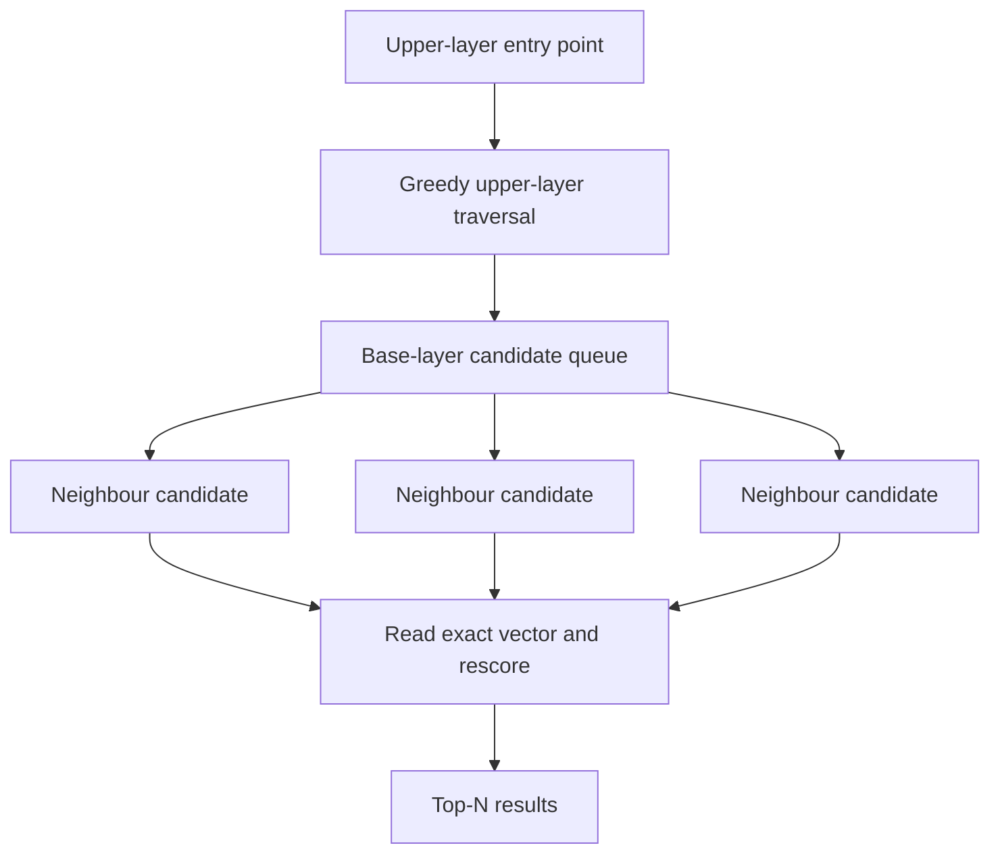

# Vector search

Use this guide when your application already generates compatible embeddings. LeanCorpus stores and searches vectors, but does not choose an embedding model or generate embeddings from document text.

Dense float vectors are stored per segment with an HNSW graph built at flush time. Searches use HNSW when present, then rerank the shortlist with exact cosine similarity.



## Index

```csharp
var doc = new LeanDocument();
doc.Add(new StringField("id", "v1"));
doc.Add(new VectorField("embedding", new float[] { 0.1f, 0.2f, 0.3f, 0.4f }));
writer.AddDocument(doc);
```

All vectors in the same field must have the same dimensionality. Vectors are normalised at index time by default (keeps cosine search cheap). Keep the embedding model, normalisation policy and dimension under application control. Reindex the field when any of those change.

## Query

```csharp
var query = new VectorQuery(
    "embedding",
    queryVector,
    topK: 10,
    efSearch: 128,
    oversamplingFactor: 2);

var hits = searcher.Search(query, topN: 10);
```

Score is cosine similarity, range `[-1, 1]` (typically `[0, 1]` for normalised vectors).

## Build settings

```csharp
var config = new IndexWriterConfig
{
    NormaliseVectors = true,
    BuildHnswOnFlush = true,
    HnswBuildConfig = new HnswBuildConfig
    {
        M = 16,
        EfConstruction = 100,
    },
};
```

Set `HnswSeed` for reproducible graph builds.

## Hybrid retrieval

Combine vector with text via RRF:

```csharp
var rrf = new RrfQuery()
    .Add(new TermQuery("body", "machine learning"))
    .Add(new VectorQuery("embedding", queryVector, topK: 50));
```

Or add a filter directly:

```csharp
var filter = new TermQuery("category", "docs");
var query = new VectorQuery("embedding", queryVector, topK: 10, filter: filter);
```

Apply the filter for tenant, category or permission boundaries rather than filtering results after retrieval. The filter participates in candidate selection and preserves the scope of the search.

## Fallback

If no HNSW graph exists, falls back to a flat SIMD scan. Vector readers are opened lazily, so non-vector searches don't pay the mmap cost.

## Quantisation

BBQ (binary quantisation) compresses float32 vectors 32× into single-bit buckets. The HNSW graph is built over the compressed space, and the shortlist is reranked with exact cosine distance:

```csharp
var config = new IndexWriterConfig
{
    BuildHnswOnFlush = true,
    VectorQuantisation = VectorQuantisation.BBQ,
};
```

Int8 scalar quantisation is also available, compressing 4× with a per-vector min/max scale:

```csharp
var config = new IndexWriterConfig
{
    VectorQuantisation = VectorQuantisation.Int8,
};
```

Quantised vectors reduce storage and HNSW graph memory at the cost of a small recall penalty. Use BBQ for disk-bound workloads; Int8 when precision matters more. Measure recall against exact search on your own corpus before changing `efSearch`, oversampling or quantisation.

## See also

- [Filtered vector search](08-filtered-vector-search.md)
- [Reciprocal rank fusion](04-rrf.md)
- <xref:Rowles.LeanCorpus.Search.Queries.VectorQuery>
