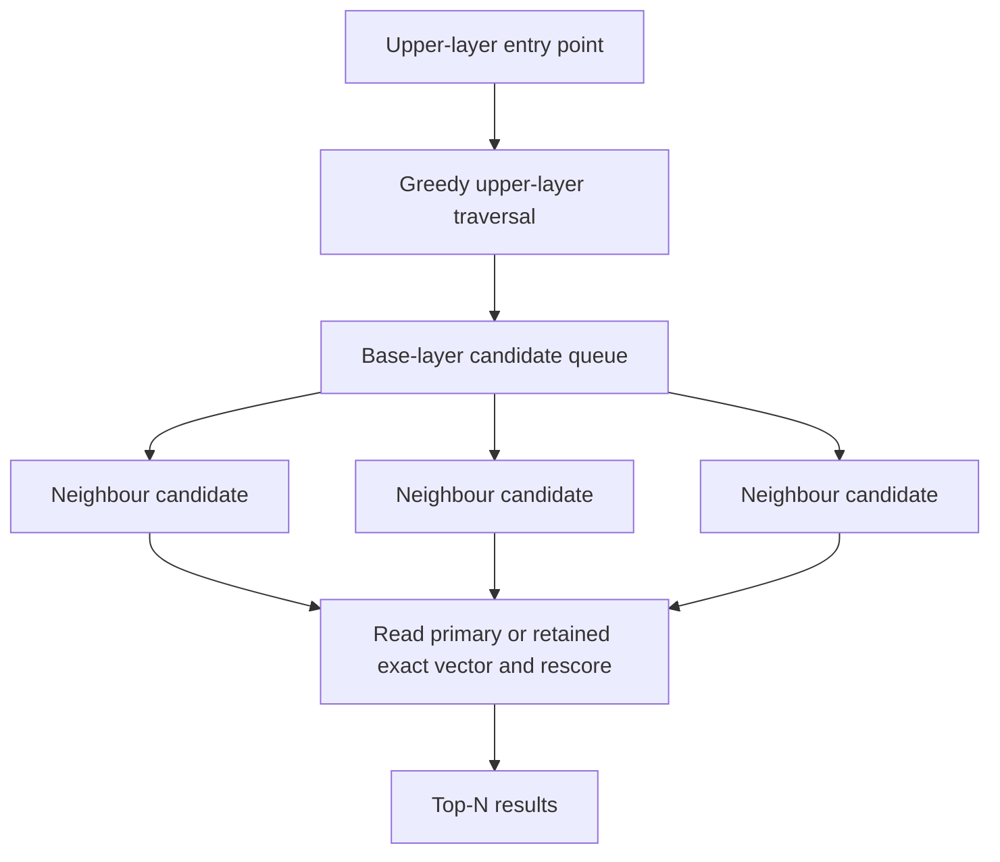

# Vector search

Dense vectors are stored per segment with an HNSW graph built at flush time. Searches use HNSW when present, then rescore the shortlist from the field's primary encoding. Quantised fields can retain a Float32 sidecar for exact reranking.



## Index

```csharp
var doc = new LeanDocument();
doc.Add(new StringField("id", "v1"));
doc.Add(new VectorField("embedding", new float[] { 0.1f, 0.2f, 0.3f, 0.4f }));
writer.AddDocument(doc);
```

All vectors in the same field must have the same dimensionality. Vectors are normalised at index time by default (keeps cosine search cheap).

## Query

```csharp
var query = new VectorQuery(
    "embedding",
    queryVector,
    topK: 10,
    efSearch: 128,
    oversamplingFactor: 2);

var hits = searcher.Search(query, topN: 10);
```

Score is cosine similarity, range `[-1, 1]` (typically `[0, 1]` for normalised vectors).

## Build settings

```csharp
var config = new IndexWriterConfig
{
    NormaliseVectors = true,
    BuildHnswOnFlush = true,
    HnswBuildConfig = new HnswBuildConfig
    {
        M = 16,
        EfConstruction = 100,
    },
};
```

Set `HnswSeed` for reproducible graph builds.

## Hybrid retrieval

Combine vector with text via RRF:

```csharp
var rrf = new RrfQuery()
    .Add(new TermQuery("body", "machine learning"))
    .Add(new VectorQuery("embedding", queryVector, topK: 50));
```

Or add a filter directly:

```csharp
var filter = new TermQuery("category", "docs");
var query = new VectorQuery("embedding", queryVector, topK: 10, filter: filter);
```

## Fallback

If no HNSW graph exists, falls back to a flat SIMD scan. Vector readers are opened lazily, so non-vector searches don't pay the mmap cost.

## Quantisation

BBQ (binary quantisation) compresses float32 vectors 32× into single-bit buckets. The HNSW graph is built and searched over the compressed representation:

```csharp
var config = new IndexWriterConfig
{
    BuildHnswOnFlush = true,
    VectorQuantisation = VectorQuantisation.BBQ,
};
```

Int8 scalar quantisation is also available, compressing 4× with a per-vector min/max scale:

```csharp
var config = new IndexWriterConfig
{
    VectorQuantisation = VectorQuantisation.Int8,
};
```

Four-bit scalar quantisation packs two scalar values into each byte:

```csharp
var config = new IndexWriterConfig
{
    VectorQuantisation = VectorQuantisation.Int4,
};
```

Set `RetainFullPrecision = true` in the field's `VectorFieldConfig` when the final shortlist must be reranked from a Float32 sidecar. Without that sidecar, diagnostics report reconstructed quantised score provenance.

Product quantisation and `RaBitQ` were rejected by ADR016 and cannot be selected for new indexes. Their readers remain so existing or experimental files can be inspected and migrated. The final PQ experiment used four-dimensional routing codes and one-dimensional final codes in the version 5 `.vq` format; versions 3 and 4 remain readable as single-level PQ. It passed storage and latency checks but achieved only 0.794 recall@10 at 128 dimensions under the declared default search budget.

Quantised vectors reduce storage at the cost of reconstruction error and possible recall loss. Measure the chosen encoding against the embedding model and workload before deployment.

## Late interaction

`MultiVectorField` stores equal-dimensional document token vectors in a versioned
binary DocValues payload. `LateInteractionQuery` computes exact weighted MaxSim:
each query token contributes its weight multiplied by its best dot product against
the document tokens. An empty multi-vector field is stored distinctly from a
missing field. It can participate in `FusionQuery` with an explicit child window.

This is an experimental exact reference path. It has no compressed candidate
generator or labelled quality evidence yet, so it is not a promoted retrieval
codec under [ADR016](../articles/ADRs/ADR016-experimental-hybrid-retrieval-ship-gates.md).

## See also

- [Filtered vector search](08-filtered-vector-search.md)
- [Reciprocal rank fusion](04-rrf.md)
- <xref:Rowles.LeanCorpus.Search.Queries.VectorQuery>
