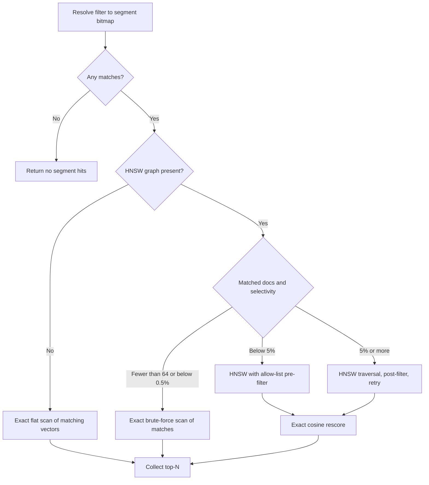

# Filtered vector search

`VectorQuery` accepts a filter for tenant, category, visibility, date, or another document constraint. The filter is evaluated per segment, then LeanCorpus chooses a vector strategy from the segment's graph and filter selectivity.

```csharp
var filter = new BooleanQueryBuilder()
    .Must(new TermQuery("tenant", tenantId))
    .Must(new TermQuery("status", "published"))
    .Build();

var query = new VectorQuery(
    field: "embedding",
    queryVector: embedding,
    topK: 20,
    efSearch: 128,
    oversamplingFactor: 2,
    filter: filter);

var hits = searcher.Search(query, topN: 20);
```

## Strategy selection



The thresholds are implementation choices, not API guarantees:

| Per-segment condition | Current strategy | Why |
|---|---|---|
| No HNSW graph | Exact flat scan | There is no approximate graph to traverse. |
| Fewer than 64 matches, or selectivity below `0.005` | Exact scan of matching documents | Graph overhead is greater than checking the small candidate set. |
| Selectivity below `0.05` | HNSW with allow-list | Traversal visits only permitted nodes. |
| Selectivity `0.05` or higher | HNSW then post-filter | A broad allow-list would constrain traversal without saving enough work. |

Selectivity is calculated independently for each segment. One query can therefore use different strategies across the index.

## Post-filter retries

Post-filtering may discard too many approximate candidates. Traversal can retry by doubling `ef`, up to three retries by default, until it has enough survivors or exhausts its retry policy.

`topK * oversamplingFactor` determines the requested shortlist. Raising `efSearch` explores more graph nodes. Raising `oversamplingFactor` retains more candidates for exact rescoring. Both can improve recall and latency cost, but they affect different stages.

## Pre-filter recall

An allow-list can disconnect useful graph routes because disallowed nodes cannot participate in traversal. That is why extremely selective filters use exact brute force and broad filters use post-filtering. Measure recall at the selectivity ranges your tenants or categories actually produce.

## Exact rescoring

HNSW produces a shortlist. LeanCorpus reads stored vectors and calculates exact cosine similarity for surviving candidates before collection. Query vectors are normalised for fields recorded as normalised. Invalid zero-length normalisation produces no matches.

Approximate traversal can still omit a true neighbour before rescoring, so exact scoring of the shortlist does not make the overall search exhaustive.

## Tuning

- Start with the unfiltered vector settings that meet recall requirements.
- Measure narrow, moderate, and broad filter selectivity separately.
- Increase `efSearch` when traversal recall is weak.
- Increase `oversamplingFactor` when filtering or reranking leaves too few competitive candidates.
- Use `Explain(VectorQuery, docId)` to confirm the selected strategy for a diagnostic document.
- Compare latency, nodes visited, and recall, not latency alone.

See [Vector search](05-vector-search.md), [Score explanations](../searching/11-score-explanations.md), and [Reciprocal rank fusion](04-rrf.md).
