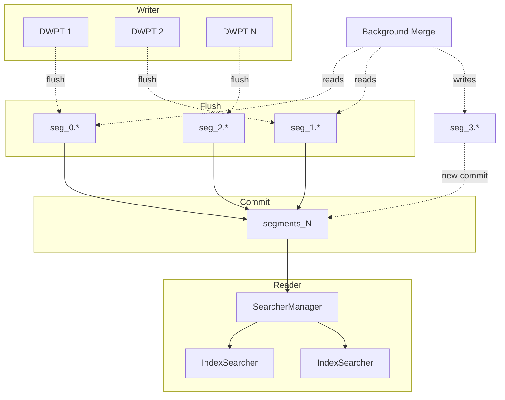

# Architecture overview

LeanCorpus is a segment-centric full-text search engine. Documents are indexed into immutable **segments**, each a self-contained set of codec files on disk. A **commit** atomically publishes a set of segments via a `segments_N` manifest. Readers open the committed segments via memory-mapped I/O.

## Indexing pipeline

1. **Documents flow into a `DocumentsWriterPerThread` pool.** Each thread gets its own DWPT with private in-memory buffers. No lock contention during document analysis.

2. **DWPTs flush independently.** When a DWPT's RAM buffer fills (controlled by `RamBufferSizeMB`), it writes a complete segment to disk. Flushes happen outside the write lock, so indexing continues on other threads.

3. **A `Commit()` snapshots all flushed segments into a `segments_N` file.** The commit is atomic: the manifest file is written, fsynced, then atomically renamed into place. Readers see either the old manifest or the new one, never a partial commit.

4. **Background merges consolidate segments.** A `MergeScheduler` picks small segments and merges them into larger ones. Merges never block commits: the merged segment appears in a subsequent commit, and the source segments are removed once no reader references them.

## Segment files

Each segment is a set of files sharing a segment ID prefix (e.g. `seg_0`). Every binary file starts with the LeanCorpus magic header and a format version.

| File | Contents |
|---|---|
| `seg_0.seg` | Segment metadata: doc count, field names, index sort, delete generation |
| `seg_0.dic` | Term dictionary (FST): `field\0term` to postings offset |
| `seg_0.pos` | Postings: block-packed doc IDs, frequencies, positions |
| `seg_0.fdt` | Stored fields data blocks, optionally compressed |
| `seg_0.fdx` | Stored fields index: block offsets for random lookup |
| `seg_0.nrm` | Per-document field-length norms |
| `seg_0.fln` | Per-field token counts for BM25 and statistics |
| `seg_0.num` | Sparse numeric field index by doc ID |
| `seg_0.bkd` | BKD tree for numeric range queries |
| `seg_0.dvn` | Numeric DocValues (single-valued, sorting/aggregation) |
| `seg_0.dvs` | Sorted DocValues (single-valued string ordinals) |
| `seg_0.dss` | Sorted-set DocValues (multi-valued string ordinals) |
| `seg_0.dsn` | Sorted-numeric DocValues (multi-valued numeric) |
| `seg_0.dvb` | Binary DocValues (multi-valued byte columns) |
| `seg_0.vec` | Dense float vectors per field |
| `seg_0.hnsw` | HNSW graph for approximate nearest neighbour |
| `seg_0.tvd` / `seg_0.tvx` | Term vectors (data and index) |
| `seg_0.pbs` | Parent bitset for block-join queries |
| `seg_0.del` | Deleted-document bitset |
| `segments_N` | Commit manifest: live segment IDs, generation, CRC32 trailer |
| `write.lock` | Writer lock file |

Files are validated at open time: the `IndexValidator.Check` method and `leancorpus-cli check` verify magic headers, format versions, and structural integrity for every codec file in every segment.

## I/O model

LeanCorpus uses `MMapDirectory` for all reads. Segment files are opened as memory-mapped files, and the OS page cache handles I/O. This means:

- **Warm reads** hit the page cache with no syscall overhead.
- **Cold reads** fault pages in on demand, without an explicit readahead thread.
- **Multiple searchers** on the same index share the same physical pages.
- **No buffer-pool tuning.** The OS manages eviction under memory pressure.

Writes use buffered `IndexOutput` wrappers with sequential streaming. Atomic commit relies on `File.Move` (rename) semantics: the manifest is written to a temporary path, fsynced, then renamed over the previous `segments_N`.

## Searcher lifecycle

`SearcherManager` owns the reader lifecycle:

1. On construction, it opens an `IndexSearcher` on the latest commit.
2. A background timer polls for new `segments_N` files at `RefreshInterval`.
3. When a new commit is detected, a fresh `IndexSearcher` is opened and swapped in atomically.
4. Old searchers are disposed once all outstanding leases are released.

Callers acquire a `SearcherLease` (via `AcquireLease()` or the `UsingSearcher` convenience method) to pin a searcher for the duration of a query. The lease prevents disposal while queries are in flight.

## Segment reader leases

Internally, `SegmentReader` state is protected by a lease mechanism. Heavy resources (postings decoders, DocValues readers, vector graphs, FST terms dictionaries) are opened lazily on first access and cached per reader. A `QueryLease` acquired before a search loop prevents eviction of cached state while the loop runs. This bounds resident memory without compromising correctness under concurrent access.

## Deletions

Deleted documents are tracked via per-segment bitsets (`seg_N.del`). A delete is buffered in memory and flushed at commit time. The bitset is consulted during scoring: deleted documents are skipped. Merges physically remove deleted documents, reclaiming disk space.

Soft deletes layer on top: a soft-deleted document is excluded from results but retained on disk until the retention period expires and a merge reclaims it.

## Index sorting

When `IndexSort` is configured, segments are sorted by the specified fields during flush. This enables early termination for sorted queries (fetch top-N by sort key without scoring all matches) and improves compression of DocValues columns by grouping similar values.
