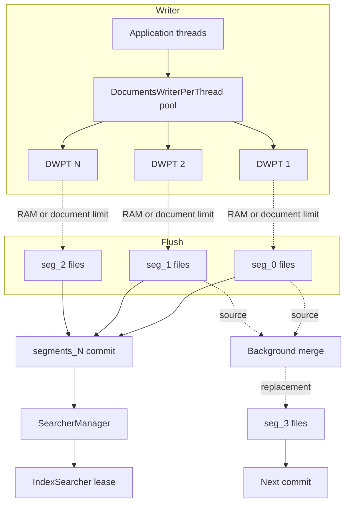
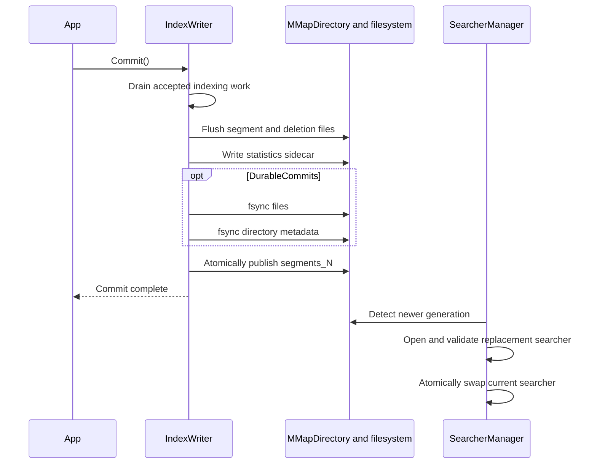
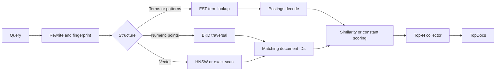
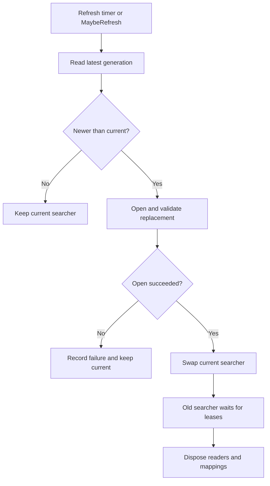

# Architecture overview

LeanCorpus is a segment-centric search engine. Indexing writes immutable segments, commits publish a coherent set of segments, and searchers open one committed view through memory-mapped I/O.

## Core invariants

- Segment contents do not change after publication.
- A commit manifest names only complete files.
- A searcher sees one commit generation, never a mixture.
- Deletions hide documents immediately after commit and are reclaimed physically by merges.
- Segment files remain available while a searcher, snapshot, or retained commit can still reference them.
- Readers validate format and bounds before trusting file contents.

## Indexing pipeline

Each producer acquires a documents-writer-per-thread buffer. Analysis, postings accumulation, stored fields, DocValues, numeric points, and vectors are collected in private state. This reduces lock contention between indexing threads.

A buffer flushes when a RAM, per-thread, or document threshold is reached. Flush writes a complete segment. Concurrent flush and merge limits keep memory and storage pressure bounded.

The writer has two different visibility boundaries:

- a flush creates files but does not make them visible to ordinary committed readers;
- a commit publishes a new `segments_N` generation containing the selected segments and deletion state.

## Commit lifecycle

The manifest is published last. If a process stops during an earlier step, recovery can ignore incomplete files and retain the previous complete generation.

## Background merging

Merge policy chooses compatible source segments. The merge scheduler writes a new immutable segment while indexing and commits continue. A later commit replaces the source segments with the merged output.

Source files are not immediately deletable. Active searchers, snapshots, or retained commits may still own them. This is why on-disk size can temporarily exceed the current commit's logical size.

Merges also:

- apply deletions physically;
- rebuild term dictionaries and postings;
- remap DocValues, vectors, HNSW nodes, parent markers, and sort metadata;
- preserve codec and scoring invariants;
- improve query locality by reducing segment count.

## Segment files

A segment uses a common identifier such as `seg_0` across its files. Required and optional files include:

| File | Contents |
|---|---|
| `.seg` | Segment metadata, fields, document count, sort, vectors, and deletion generation |
| `.dic` | FST term dictionary mapping `field\0term` to postings metadata |
| `.pos` | Block-packed document IDs, frequencies, positions, offsets, and optional payloads |
| `.fdt`, `.fdx` | Stored-field block data and random-access block index |
| `.nrm`, `.fln` | Norms, field boosts, and exact field-length data |
| `.num`, `.numl` | Sparse numeric and 64-bit integer field indexes |
| `.bkd`, `.bkdl` | BKD trees for `double` and 64-bit integer range search |
| `.dvn`, `.dvnl` | Numeric and 64-bit integer DocValues |
| `.dvs`, `.dss` | Sorted and sorted-set string DocValues |
| `.dsn`, `.dsnl` | Sorted-numeric DocValues |
| `.dvb` | Binary DocValues |
| `.vec`, `.vq`, `.hnsw` | Exact vectors, quantised vectors, and HNSW graph |
| `.tvd`, `.tvx` | Term-vector data and index |
| `.pbs` | Parent markers for block join |
| `.del` | Roaring bitmap of deleted documents |
| `segments_N` | Commit manifest and commit checksum |
| `stats_N.json` | Recoverable collection-statistics sidecar |
| `write.lock` | Single-writer ownership |

Formats do not all share one universal magic-header and CRC layout. Versioned CodecKit envelopes, streaming headers, unframed metadata, and the commit checksum are distinct. See [Storage formats](contributors/storage-formats.md) for the byte-level design.

## Search execution

Term queries seek through the FST and decode postings. Numeric ranges prune BKD cells. Vector queries use HNSW when available and exact flat search otherwise. Compound queries combine these primitives.

BM25 uses collection-wide statistics so scores remain comparable across segments. Optional Block-Max WAND can skip postings blocks whose score upper bounds cannot enter the current top-N.

## Internal data structures

| Structure | Role |
|---|---|
| FST | Compact term dictionary and automaton traversal |
| Packed integers | Block encoding for postings and related integer streams |
| BKD tree | Recursive numeric-space partitioning |
| HNSW | Approximate nearest-neighbour candidate graph |
| Roaring bitmap | Sparse and dense document-ID sets for deletions and filters |
| DocValues | Column-oriented values for sorting, faceting, collapsing, and aggregation |

The [search internals](contributors/search-internals.md) page describes their algorithms and contributor invariants.

## I/O model

`MMapDirectory` maps immutable files and lets the operating-system page cache manage the working set.

- Warm reads are served from resident pages.
- Cold reads fault pages on demand.
- Searchers over the same files can share physical pages.
- Managed allocation and resident mapped memory are different measurements.

`IndexInput` provides bounded seeking and slices. `IndexOutput` provides sequential writing. Atomic file publication, directory fsync, and transient open retries stay behind the Store boundary.

See [Store and file I/O](index-management/10-store-and-file-io.md).

## Searcher lifecycle

`SearcherManager` opens the latest commit and polls for newer generations. It opens a complete replacement before swapping it into service.

Callers use `AcquireLease()` or `UsingSearcher`. A lease prevents the selected searcher from being disposed while a query is in flight.

Segment readers open heavier structures lazily and retain them in a bounded cache. Query leases protect active structures from eviction during an execution loop.

## Deletions and soft deletions

Deletes are resolved to per-segment document IDs and published with a commit. Search paths check live-document state before collecting a hit. A later merge omits deleted documents.

Soft deletion adds retention metadata. Soft-deleted documents are not searchable, but merge reclamation waits until `SoftDeleteRetentionSeconds` has elapsed.

## Index sorting

`IndexSort` physically orders documents within newly flushed and merged segments. Matching sorts can terminate early after enough competitive documents. Grouping similar values can also improve DocValues compression.

Index sorting changes document-ID assignment and write cost. Configure it before building the corpus when applications rely on consistent behaviour across every segment.

## Learn more

- [Contributor architecture internals](contributors/architecture-internals.md)
- [Storage formats](contributors/storage-formats.md)
- [Search internals](contributors/search-internals.md)
- [Validation and recovery](index-management/03-validation-recovery.md)
