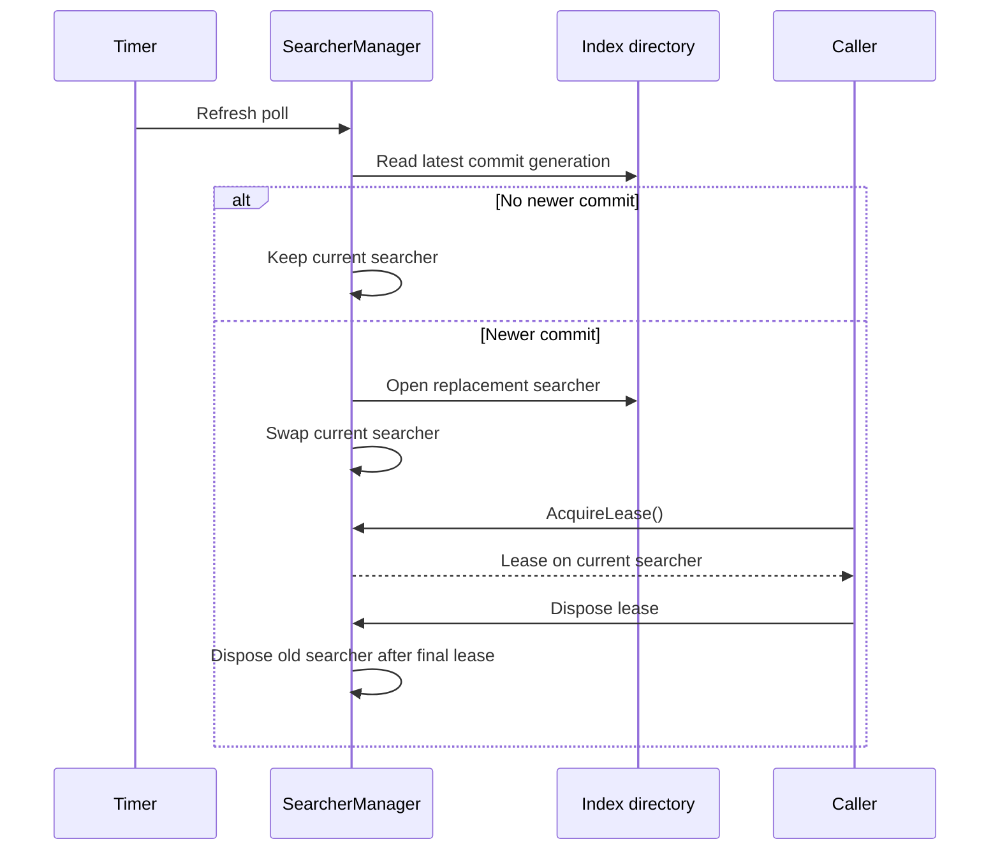

# Searcher manager

`SearcherManager` keeps a current `IndexSearcher` open and swaps in a fresh one when a new commit lands. Share one searcher across many concurrent queries.

## Setup

```csharp
using Rowles.LeanCorpus.Search.Searcher;
using Rowles.LeanCorpus.Store;

using var dir = new MMapDirectory("./index");
using var manager = new SearcherManager(dir, new SearcherManagerConfig
{
    RefreshInterval = TimeSpan.FromSeconds(1),
    SearcherConfig  = new IndexSearcherConfig { EnableQueryCache = true },
});
```

A background loop polls at `RefreshInterval`.



## Acquire and release

```csharp
using var lease = manager.AcquireLease();
var hits = lease.Searcher.Search(query, 10);
```

Or the convenience method:

```csharp
var hits = manager.UsingSearcher(s => s.Search(query, 10));
```

## Force refresh

```csharp
bool refreshed = manager.MaybeRefresh();
bool refreshedAsync = await manager.MaybeRefreshAsync();
```

Returns `true` when a newer commit was loaded.

The manager opens and validates the replacement before publication. A failed refresh leaves the previous healthy searcher available.

## Query cache across refresh

When query caching is enabled, the manager owns one shared `QueryCache`. Refresh invalidates its generation so old document IDs cannot be returned, while hit and miss counters continue across replacement searchers.

## Refresh failures

Errors are captured instead of crashing the background loop:

```csharp
manager.RefreshFailed += (_, e) =>
    logger.LogWarning(e.Error, "Searcher refresh failed {Count} time(s)", e.ConsecutiveFailures);

if (manager.LastRefreshError is not null)
    Console.Error.WriteLine(manager.LastRefreshError.Message);
```

## Generic reader lifecycle

Use `ReaderManager<TReader>` when the retained near-real-time reader is not an
`IndexSearcher`. It provides the same immutable swap and lease behaviour for any
`IDisposable` reader:

```csharp
using var readers = new ReaderManager<MyReader>(
    openFactory: OpenCurrent,
    refreshFactory: current => TryOpenNewer(current),
    refreshInterval: TimeSpan.FromSeconds(1));

using var lease = readers.AcquireLease();
var result = lease.Reader.Read(request);
```

The old reader is retired after publication and disposed after its final lease is
released. `GetDiagnostics()` reports active readers, leases, refreshes, failures,
and disposed readers. `SearcherManager` is implemented on this lifecycle so the
searcher-specific API remains compatible.

## Composing directory snapshots

`MultiReader` opens one immutable `IndexSearcher` per directory and assigns global
document IDs in input order. A later commit does not change an existing composition;
create a new `MultiReader` when all component snapshots should advance together.

```csharp
using var reader = new MultiReader([firstDirectory, secondDirectory]);
var hits = reader.Search(query, 20, SortField.String("category"));
var nextPage = reader.SearchAfter(hits.ScoreDocs[^1], query, 20, SortField.String("category"));
```

`GetOrdinalMap(fieldName, sortedSet: true)` returns stable term-order ordinals across
the component snapshots. This is also used when federated facet counts are merged.

## See also

- [Refresh failures](04-refresh-failures.md)
- <xref:Rowles.LeanCorpus.Search.Searcher.SearcherManager>
