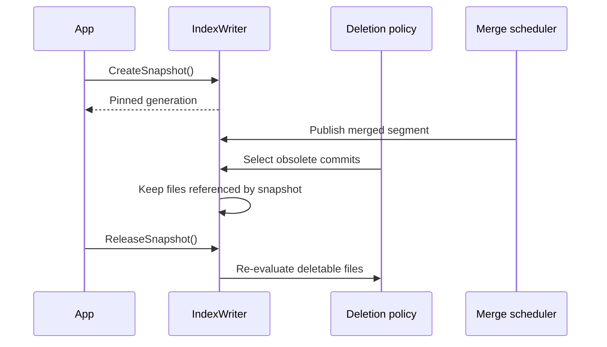

# Snapshots and deletion policies

An `IndexSnapshot` pins one committed generation so its segment files cannot be removed while a caller inspects or copies them.

## Snapshot lifecycle

```csharp
var snapshot = writer.CreateSnapshot();
try
{
    Console.WriteLine(
        $"Generation {snapshot.CommitGeneration}, " +
        $"{snapshot.Segments.Count} segments, " +
        $"taken at {snapshot.TakenAtUtc:O}");

    var backup = writer.BackupSnapshot(
        snapshot,
        "/srv/backups/index-" + snapshot.CommitGeneration);
}
finally
{
    writer.ReleaseSnapshot(snapshot);
}
```

The snapshot exposes:

| Property | Meaning |
|---|---|
| `CommitGeneration` | Pinned `segments_N` generation |
| `Segments` | Defensive copy of the segment metadata |
| `TakenAtUtc` | Snapshot creation time |

Always release in `finally`. An unreleased snapshot retains files until the writer is disposed.



## Deletion policies

`IndexWriterConfig.DeletionPolicy` controls which old commits remain when they are not pinned:

| Policy | Behaviour | Trade-off |
|---|---|---|
| `KeepLatestCommitPolicy` | Retains the newest commit | Minimum steady-state history and disk usage |
| `KeepLastNCommitsPolicy(n)` | Retains the newest `n` generations | Faster local rollback at additional disk cost |

```csharp
var config = new IndexWriterConfig
{
    DeletionPolicy = new KeepLastNCommitsPolicy(maxCommits: 5),
};
```

Retaining commits is not a backup. All generations remain in the same directory and share unchanged segment files, so host or directory loss affects them together.

## Merge interaction

A merge creates a replacement segment but cannot remove source files while any retained commit, active searcher, or snapshot still references them. Long-lived snapshots can therefore prevent expected disk reclamation even though indexing and merging continue normally.

Monitor snapshot duration and free disk space. Keep snapshots around a bounded copy operation, not an application session.

## Choosing a policy

Use `KeepLatestCommitPolicy` with independent backups for most services. Use `KeepLastNCommitsPolicy` when a short local rollback window has operational value and disk growth is measured.

Commit count is not a time guarantee. A busy writer can produce several retained generations quickly, while a quiet writer can retain them for a long time.

See [Backup and restore](../index-management/08-backup-and-restore.md) for a complete manifest-based copy.
