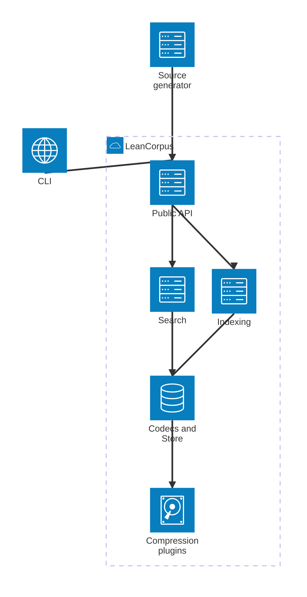
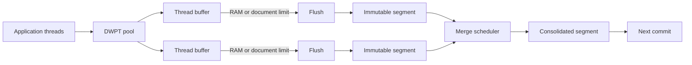
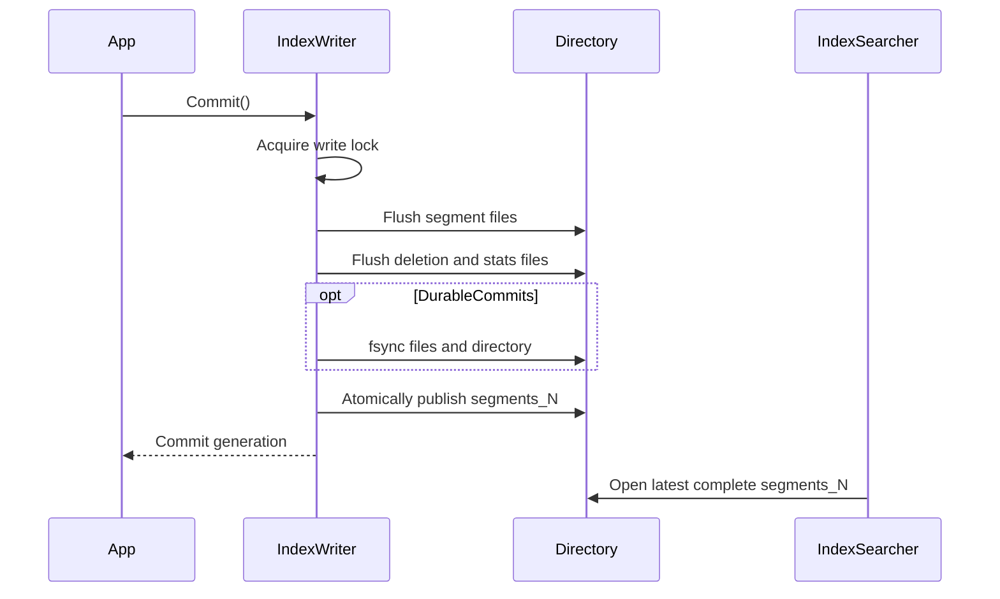

# Architecture internals

LeanCorpus is organised around immutable segments. Indexing creates new segments, deletion records hide documents in existing segments, merges consolidate compatible segments, and commits publish a coherent manifest.

The public [architecture overview](../architecture.md) explains the model from an application perspective. This page concentrates on ownership, concurrency, and the boundaries contributors must preserve.

## Component boundaries

`Rowles.LeanCorpus` owns the core file formats and abstractions. Optional compression projects implement provider contracts without becoming dependencies of the core package. The source generator emits mappings against public contracts. The CLI consumes the same operational APIs available to applications.

## Indexing path

Each indexing thread writes through a documents-writer-per-thread buffer. A buffer becomes eligible for flushing when document or RAM limits are reached. Flushed segments are immutable, then merge policy decisions may schedule background consolidation.

The backpressure settings on `IndexWriterConfig` constrain queued documents, queued bytes, concurrent flushes, concurrent merges, and pending merge bytes. Changes in this area must preserve bounded memory, document ordering guarantees, and commit visibility.

## Commit publication

A commit must not expose a manifest that names incomplete files. The writer flushes pending work, makes file contents durable when configured to do so, and publishes the new `segments_N` file last.

Recovery can discard an incomplete newest generation because the previous committed manifest and its referenced immutable files remain valid.

## Searcher ownership

An `IndexSearcher` owns a coherent commit view. Segment readers may be opened lazily and retained in a bounded cache. Cross-directory file-lifetime leases prevent deletion of files still reachable by an active reader.

`SearcherManager` periodically checks for a newer commit. Refresh creates a replacement searcher before swapping the current instance. Existing leases continue to use the old searcher until released.

The important invariants are:

- a search sees one commit generation, never a mixture;
- a refreshed searcher is fully usable before publication;
- old segment files remain available while any reader can still open or use them;
- refresh failure retains the last healthy searcher;
- disposal releases leases and memory-mapped views in a defined order.

## Merge ownership

Merge policy chooses candidates. The merge scheduler controls when work runs and how much may be pending. The writer publishes merged output only after it is complete. Source segments cannot be removed while snapshots, searchers, or another commit still reference them.

Do not assume that `Compact()` or `ForceMerge(1)` is a routine maintenance operation. Both can rewrite large portions of an index and require substantial temporary disk space. They are explicit operational choices, not a substitute for correct lifetime management.

## Native AOT boundary

Core paths avoid runtime code generation and reflection-dependent discovery. New extensibility points should use explicit registration, source generation, or statically reachable implementations. Validate changes that affect serialisation, generated mappings, or plugin discovery with the repository AOT command.

## Related material

- [Storage formats](storage-formats.md)
- [Search internals](search-internals.md)
- [Concurrency and `SearcherManager`](../concurrency/01-searcher-manager.md)
- [Snapshots and deletion policies](../concurrency/03-snapshots-and-policies.md)
- [Validation and recovery](../index-management/03-validation-recovery.md)
