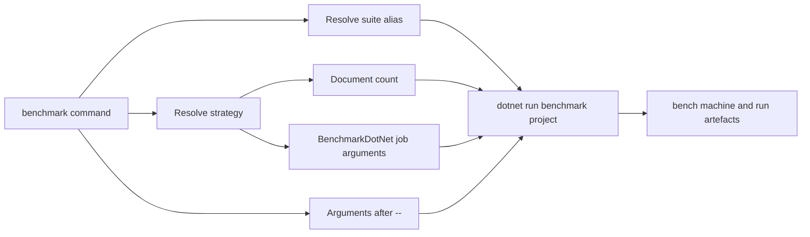

# DevOps entry point

The repository-level `devops` command is the supported router for build, test, AOT, coverage, benchmark, data, and documentation workflows.

On Linux and macOS, `devops` is a small Bash wrapper that invokes PowerShell:

```text
./devops <command> [arguments]
        |
        +-- pwsh -NoProfile -File devops.ps1 ...
```

On Windows, the equivalent entry point is `devops.ps1`. Keep behaviour in the PowerShell implementation so both routes stay aligned.

## Why it exists

The entry point centralises:

- project and framework selection;
- suite and strategy aliases;
- generated-output locations;
- benchmark provenance;
- documentation metadata and report generation;
- tool discovery;
- consistent failure handling across local use and CI.

Callers should not need to reproduce long `dotnet` command lines or know which generated directories must be prepared first.

## Command map

| Command | Purpose | Typical example |
|---|---|---|
| `build` | Restore and build the supported solution targets | `./devops build` |
| `test` | Run one or more registered test suites | `./devops test` |
| `aot` | Publish and run Native AOT smoke validation | `./devops aot` |
| `coverage` | Collect coverage and optionally generate a report | `./devops coverage` |
| `benchmark` | List or run BenchmarkDotNet suites | `./devops benchmark -List` |
| `data` | Prepare a named benchmark corpus | `./devops data gutenberg` |
| `docs` | Generate API metadata and build or serve DocFX | `./devops docs -SkipBenchmarks` |
| `server start` | Start the Community Server in the foreground on loopback, or use `-External` for trusted-network access | `./devops server start -External` |
| `benchmarks docs` | Regenerate benchmark documentation pages | `./devops benchmarks docs` |

Use `benchmark` for running measurements and `benchmarks docs` for publishing existing result artefacts. The plural command is intentionally not a second benchmark runner.

## Argument handling

The script combines two styles:

- command or subcommand tokens such as `docs serve`, `server start` and `data wikipedia`;
- PowerShell-style named options such as `-Suite query`, `-Framework net10.0`, and `-SkipBenchmarks`.

BenchmarkDotNet arguments follow a `--` separator:

```powershell
./devops benchmark -Suite query -Strat quick-compare -- --filter "*TermQuery*"
```

Keep repository arguments before `--`. Everything after it is passed to the benchmark process.

## Test suites

`scripts/devops/config/test-suites.psd1` is the canonical alias map. It maps short names to project paths or, for Native AOT, to the dedicated command route. The current suites are `core`, `text`, `sourcegen`, `architecture`, `server-abstractions`, `server-core`, `server-integration`, and `aot`. The server suites are fixed to their net11.0-only projects even when the general test framework remains net10.0.

When adding a test project:

1. add it to the solution and normal build wiring;
2. add a clear alias to `test-suites.psd1`;
3. make the default test selection explicit;
4. update CI only when the suite belongs in required validation;
5. update contributor documentation when its role is not obvious.

Do not bypass the central map with a second list in another script.

## Benchmarks

`scripts/devops/config/benchmark-suites.psd1` maps public aliases such as `query`, `hnsw`, `blockjoin`, and `query-cache` to benchmark suite selections. `benchmark-strategies.psd1` and `Resolve-BenchmarkStrategy` define workload and BenchmarkDotNet job presets.



`-Dry` prints the resolved command. Use it when changing routing or investigating a remote invocation.

`-Controlled` applies a deterministic diagnostic preset and selects corpus-only cases. It does not make different hardware or runtime environments equivalent.

When adding an alias, keep its name short and stable. Point it at an existing benchmark-suite selector rather than adding benchmark logic to `devops.ps1`.

## Documentation workflow

The `docs` command has `build`, `metadata`, and `serve` paths.

The build sequence can:

1. regenerate the feature-comparison index from item front matter;
2. regenerate the ADR index;
3. copy canonical repository guides into the ignored `docs/.generated` staging tree;
4. regenerate benchmark pages unless `-SkipBenchmarks` is set;
5. regenerate coverage HTML when source data exists unless `-SkipCoverage` is set;
6. clear and regenerate DocFX API metadata;
7. remove inherited external members from generated API YAML;
8. copy changelog content;
9. build the DocFX site.

`-SkipBenchmarks` avoids an expensive or unrelated benchmark-report refresh. It does not skip conceptual pages or API metadata.

DocFX warnings are grouped by code in the console. Complete metadata and build diagnostics are written as JSON lines to `artifacts/docs/docfx-metadata.jsonl` and `artifacts/docs/docfx-build.jsonl`. A status line is printed every 30 seconds while DocFX is running so a slow API pass does not appear stuck.

Generated repository copies, API, site, benchmark, and coverage output must remain generated. Change their canonical source or generator instead of patching the output.

## Tool discovery

Some commands check for global .NET tools such as DocFX or ReportGenerator and install them when absent. Keep tool use narrow and version decisions deliberate.

The current DocFX tool release bundles its own frontend dependencies. The documentation diagram pipeline separately pins authoring dependencies under `docs/diagrams` where a version must be controlled by the repository.

## Adding a command

Add a top-level command only when it represents a durable repository workflow. Prefer extending an existing command when the new behaviour shares its inputs and outputs.

A new command should:

- parse arguments before doing work;
- validate aliases and paths with a useful error;
- use existing helper functions and repository scripts;
- return the underlying process exit code;
- avoid changing generated or source directories outside its stated scope;
- work through the Bash wrapper and direct PowerShell invocation;
- have one concise example in contributor documentation;
- remain non-interactive in CI.

Keep download and data-preparation logic in `scripts`, with `devops.ps1` acting as the router.

## CI contract

`.github/workflows/build.yml` is the required validation contract. The DevOps entry point and CI should use equivalent commands where practical, but local-only diagnostics and expensive repeated benchmarks should remain opt-in unless they are intentionally promoted to merge validation.

When changing routing, inspect both local callers and workflow callers before removing an option or alias.
