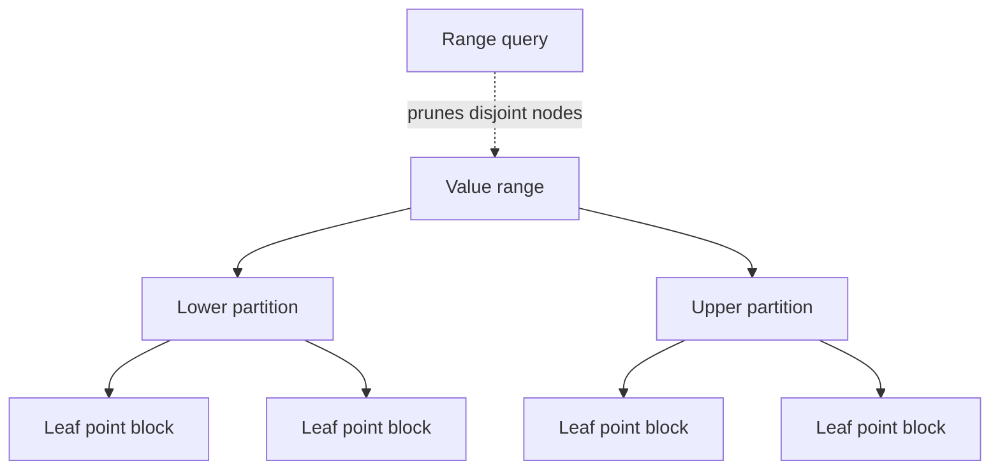
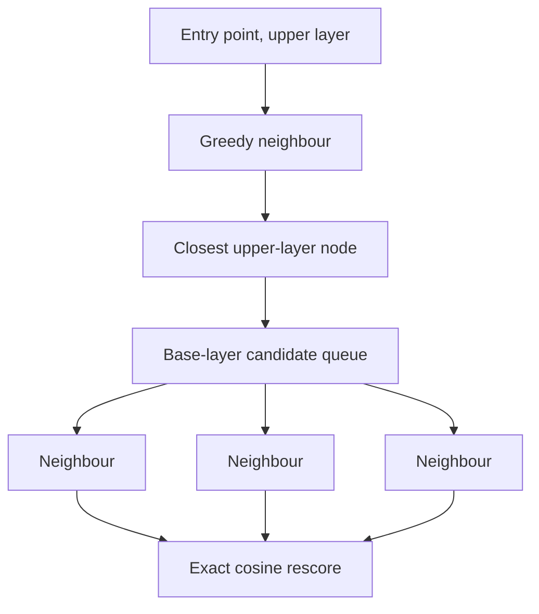

# Search internals

Search is a pipeline from query rewriting to segment execution, scoring, and collection. The public query API hides most codec and segment details, but changes inside the pipeline must preserve result ordering, cancellation, memory budgets, and exact scoring semantics.

## Query rewrite

Compound and multi-term queries rewrite into executable segment-level forms. Rewriting should be deterministic and bounded. A query cache fingerprint must include every input capable of changing matches or ordering, including boosts, vectors, filters, and requested result count.

## Term dictionary and postings

The FST term dictionary maps indexed terms to postings metadata while sharing common byte prefixes. `FstBuilder` creates the automaton and `FstReader` performs exact and prefix traversal. `PrefixAutomaton` and `LevenshteinAutomaton` support multi-term query expansion without scanning every string eagerly.

Postings are block encoded. `PackedIntCodec` packs integer blocks to the smallest useful bit width, reducing I/O at the cost of block decode work. Skip data lets scorers advance without decoding every document.

Positions, offsets, payloads, and term vectors are optional. A reader must use the field metadata to avoid interpreting absent streams.

## Numeric points and BKD

Numeric points are encoded into sortable bytes and partitioned recursively by the BKD writer. Internal nodes divide the value space; leaves hold compact point blocks.

A range query skips disjoint cells, accepts cells wholly inside the range, and checks individual values only in intersecting leaves. `BKDMaxLeafSize` trades tree depth against leaf scan work.

## Vector values and HNSW

Vectors are stored independently from the optional HNSW graph. This permits exact flat search when no graph exists and exact rescoring of approximate candidates.

Filtered vector search chooses between brute-force matching documents, HNSW with an allow-list, and post-filtered HNSW with retries. The thresholds and retry behaviour are described in [Filtered vector search](../advanced/08-filtered-vector-search.md).

HNSW level numbering must remain coherent after document remapping. If `maxLevel` is the highest retained level, `levelCount` is `maxLevel + 1`.

## Roaring bitmaps

`RoaringBitmap` partitions document IDs by their high bits and chooses compact containers for the low bits. It backs deletion and filter-oriented data where sparse and dense regions can coexist. `RoaringBitmapBitSet` exposes the common `IBitSet` contract.

Serialised bitmaps must validate container counts, cardinalities, ordering, and bounds before materialising data. Intersection paths may use SIMD acceleration when the hardware supports it.

## SIMD operations

`SimdVectorOps` provides cosine similarity, dot product, and normalisation using the best available vector width with a scalar fallback. `SimdIntersection` accelerates sorted integer intersections. Callers must preserve identical numerical and ordering semantics across hardware paths.

Benchmark vector widths and tail lengths separately. A faster intrinsic loop is not useful if conversion, allocation, or dispatch dominates the full operation.

## Scoring and Block-Max WAND

BM25 uses term frequency, document frequency, field length, and average field length from segment or persisted collection statistics. Score explanations expose these factors.

Block-Max WAND stores or computes score upper bounds for postings blocks. When enabled, the scorer can skip blocks that cannot beat the current competitive threshold. It must fall back to complete scoring whenever an upper bound is missing, invalid, or cannot safely cover the active similarity and boost combination.

`EnableBlockMaxWand` is disabled by default. Measure it on top-N disjunction workloads, and verify result and score parity against the exhaustive path.

## Collection statistics

`IndexStats` records total and live document counts plus field document counts and length sums. `stats_N.json` can avoid rescanning segments when opening a commit. A missing or corrupt statistics file is recoverable: readers compute statistics from the segment data.

Statistics belong to a commit generation. Never combine persisted statistics from one generation with segment files from another.

## Resource controls

Search checks cancellation, timeout, and result-memory budgets at defined points. Streaming results alter collection behaviour rather than merely changing the return type. New collectors and scorers must propagate these controls instead of bypassing them.

See [Resource controls](../searching/09-resource-controls.md), [Score explanations](../searching/11-score-explanations.md), and [Query cache](../tips/02-query-cache.md).
