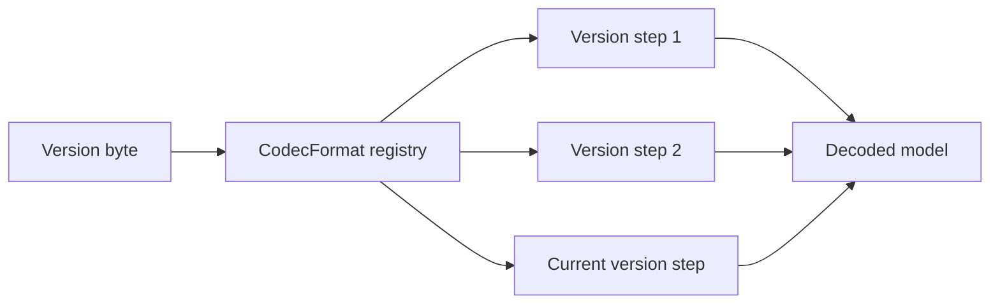

# Storage formats

A LeanCorpus commit is a manifest plus a set of immutable segment files. Format changes must preserve the ability to identify the version being read, reject malformed lengths before allocating, and either remain readable or have an explicit migration path.

## Segment inventory

The exact inventory depends on the fields and features used by a segment.

| Extension | Contents |
|---|---|
| `.dic` | Term dictionary backed by an FST |
| `.pos` | Postings, frequencies, positions, offsets, and optional payloads |
| `.fdt`, `.fdx` | Stored-field data and block index |
| `.dvd`, `.dvm` | DocValues data and metadata |
| `.nrm` | Field-length norms |
| `.bkd` | Numeric point index |
| `.vec`, `.vem`, `.hnsw` | Vector values, vector metadata, and optional HNSW graph |
| `.tvd`, `.tvx` | Term-vector data and index |
| `.del` | Deletion bitmap |
| `.sdel` | Soft-deletion metadata |
| `.pbs` | Parent markers for block joins |
| `.srt` | Index-sort metadata |

`segments_N` identifies the files belonging to a commit. Collection statistics may be stored separately as `stats_N.json`.

## CodecKit envelope

Most CodecKit-framed files begin with a one-byte format version followed by a variable-length body size and the body. The size is validated before the body is allocated or decoded.


The diagram is generated from `docs/diagrams/codeckit-envelope.edn` using Bytefield-SVG. The SVG is committed so DocFX builds do not require Node.js. Run `npm ci` and `npm run diagrams` in `docs/diagrams` after changing its source.

Some streaming formats use a trailer form instead:

```text
[version: byte] [body: bodyLength bytes] [bodyLength: int64 little-endian]
```

The fixed-width trailer lets a reader seek backwards from the end. Stored fields have their own streaming header because buffering a complete stored-field file would defeat block streaming.

## Checksums

Framing and checksumming are separate concerns:

- `CodecFileHeader` identifies the version and body boundary. It does not add a checksum by itself.
- `WithChecksumCodec` wraps a codec when a checksummed payload is required.
- `segments_N` uses its commit checksum representation rather than the generic CodecKit envelope.
- file-level validation also checks declared lengths, expected versions, referenced files, and format-specific invariants.

Do not document or implement a universal `magic + body + CRC32` shape. The repository contains several deliberately different framing strategies.

## Version registration

`CodecFormat` identifies a logical format and its ordered `CodecVersionStep` readers. A writer uses the current step. A reader dispatches according to the version stored in the file.



A format change requires:

1. a new version constant and `CodecVersionStep`;
2. the previous reader retained when backward reading is supported;
3. malformed and boundary-case tests;
4. compatibility inventory and migration coverage;
5. documentation of the on-disk difference.

See [Adding formats](codeckit/02-adding-formats.md) and [Codec migrations](codeckit/03-migrations.md).

## Commit format

The commit manifest is published after all referenced files. Its checksum protects the serialised manifest. Readers reject an invalid or incomplete generation and recovery can select the latest valid predecessor.


The packet is schematic because the JSON and hexadecimal checksum text have variable lengths. Use it to explain ordering, not fixed byte offsets.

## Compatibility inspection and migration

`IndexFormatInspector` inventories codec versions without opening the index for normal search. `IndexCompatibility` evaluates that inventory against the current reader. `IndexOpenGuard` enforces the configured compatibility mode.

`IndexCodecMigrator` performs user-facing staged migration. This is distinct from adding a new `CodecVersionStep`: contributors define readable formats, while operators use migration APIs to rewrite an existing index safely.

See [validation, recovery, and compatibility](../index-management/03-validation-recovery.md) for operational examples.

## Store abstraction

`MMapDirectory` is the normal filesystem-backed directory. `IndexInput` and `IndexOutput` provide bounded reads, writes, seeking, slicing, and lifetime ownership. `IndexAtomicFileWriter`, `DirectoryFsync`, and `FileOpenRetry` centralise platform-sensitive filesystem behaviour.

Keep raw filesystem access behind the Store boundary. This preserves retry policy, atomic publication, Windows sharing behaviour, metrics, and testability.
