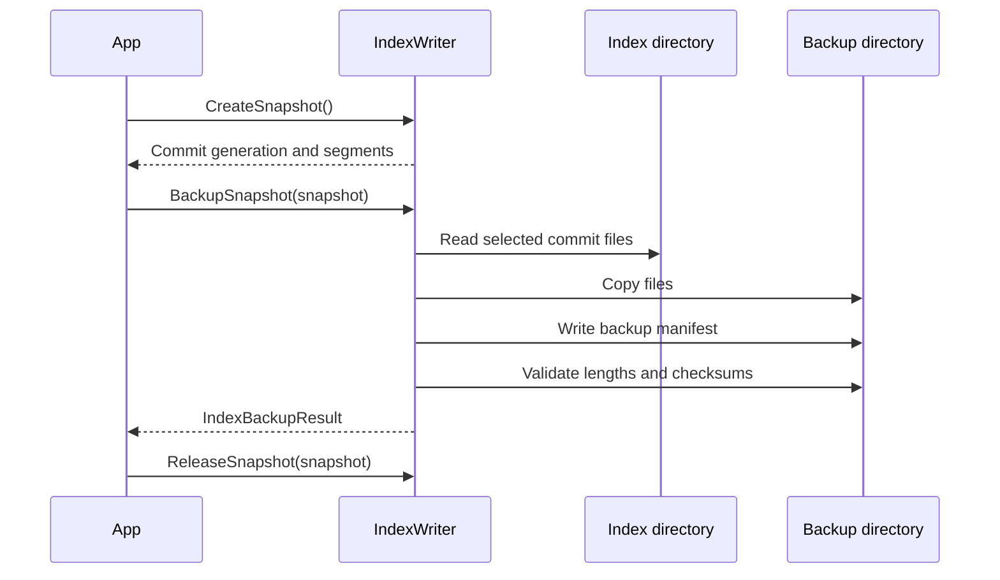

# Backup and restore

A LeanCorpus backup captures one complete committed generation, its referenced segment files, and a manifest containing file lengths and checksums. It does not copy whatever happens to be present in the directory at an arbitrary instant.

## Backup an offline or stable index

```csharp
using Rowles.LeanCorpus.Index.Backup;

var result = IndexBackup.Backup(
    indexDirectoryPath: "/srv/search/index",
    backupDirectoryPath: "/srv/backups/index-2026-07-26");

Console.WriteLine(
    $"Backed up generation {result.Manifest.CommitGeneration} " +
    $"with {result.CopiedFiles.Count} files.");
```

By default the latest readable commit is selected, commit statistics are included when present, and an existing backup directory is rejected.

```csharp
var options = new IndexBackupOptions
{
    CommitGeneration = 42,
    IncludeCommitStats = true,
    OverwriteBackupDirectory = false,
};
```

## Incremental backups

Pass the previous backup directory to reuse unchanged files. The new manifest records
the parent manifest checksum and marks inherited files without copying them again:

```csharp
var delta = IndexBackup.Backup(
    indexDirectoryPath: "/srv/search/index",
    backupDirectoryPath: "/srv/backups/index-2026-07-27",
    new IndexBackupOptions
    {
        PreviousBackupDirectoryPath = "/srv/backups/index-2026-07-26",
    });
```

Keep the full backup and every later delta available. Validate or restore the chain in
order so inherited files can be resolved:

```csharp
var chain = new[]
{
    "/srv/backups/index-2026-07-26",
    "/srv/backups/index-2026-07-27",
};

var manifest = IndexBackup.ValidateBackup(chain);
IndexBackup.Restore(chain, "/srv/search/index-restored");
```

Restoring one incremental directory by itself is rejected because it does not contain
the inherited files. Parent checksums, chain depth, file lengths, and CRCs are validated
before files are copied.

## Backup a live writer

Create a snapshot so merges and deletion policy cannot remove files while they are copied:

```csharp
var snapshot = writer.CreateSnapshot();
try
{
    var result = writer.BackupSnapshot(
        snapshot,
        "/srv/backups/index-generation-" + snapshot.CommitGeneration);
}
finally
{
    writer.ReleaseSnapshot(snapshot);
}
```

Keep the snapshot only for the copy window. A long-lived snapshot pins old segment files and can increase disk use.



## Validate a backup

```csharp
var manifest = IndexBackup.ValidateBackup("/srv/backups/index-2026-07-26");
Console.WriteLine($"Generation {manifest.CommitGeneration} is complete.");
```

Validation checks the manifest, expected files, lengths, and checksums. Run it after transport to another storage system, not only at creation time.

## Restore

Restore into an empty directory, then open or atomically switch your application to it:

```csharp
var restore = IndexBackup.Restore(
    "/srv/backups/index-2026-07-26",
    "/srv/search/index-restored",
    new IndexRestoreOptions
    {
        OverwriteTargetDirectory = false,
        ValidateAfterRestore = true,
        RestoreCommitStats = true,
    });

Console.WriteLine($"Restored {restore.RestoredFiles.Count} files.");
```

Avoid restoring over a directory in use by a writer or searcher. Restoring to a fresh sibling directory gives you a clear rollback path and avoids mixed generations.

## Backup policy

Choose cadence from recovery-point requirements and indexing cost. Retain more than one independently validated generation, and keep at least one copy outside the index host. Test restore regularly.

A filesystem or volume snapshot is safe only when it preserves the committed files and manifest coherently. Application-level backup makes that commit selection explicit and portable.

## CLI

The `leancorpus` CLI also provides backup and restore commands. See [Index checker CLI](04-cli-checker.md) for syntax.

For corrupt live indexes, use [validation and recovery](03-validation-recovery.md). Recovery and backup solve different problems: recovery finds a usable local commit; backup protects against host, disk, or directory loss.
