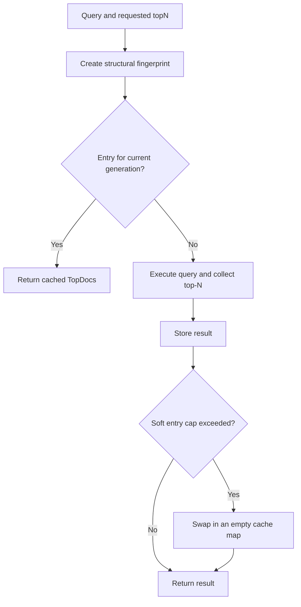

# Query cache

The query cache stores complete `TopDocs` results for a query fingerprint and requested `topN`. A hit skips query execution and top-N collection.

It does not cache per-segment bitsets and it is not an LRU.

## Enable

```csharp
var config = new IndexSearcherConfig
{
    EnableQueryCache = true,
    QueryCacheMaxEntries = 1_024,
};

using var searcher = new IndexSearcher(directory, config);
```

The cache is off by default.

## Lookup flow



## Cache identity

The fingerprint includes the query type, boost, and query-specific values. Examples include:

- field, term, range, slop, and Boolean occurrence;
- disjunction tie breaker and function-score mode;
- vector contents, `topK`, `efSearch`, oversampling, and filter;
- child-query trees;
- requested `topN`.

Two semantically identical query objects produce the same entry when their fingerprinted values match. A different `topN` is a different cache entry.

## Eviction

`QueryCacheMaxEntries` is a soft cap. When insertion takes the current map over the cap, one thread swaps the whole map for an empty concurrent dictionary. There is no least-recently-used ordering and no per-entry size accounting.

This design keeps reads lock-free and bounds retained generations simply, but a cap crossing can turn the next group of requests cold at once.

Size the cache from query repetition and result size. Each entry retains its `TopDocs`, including the score-document array, plus fingerprint and dictionary overhead. A larger `topN` costs more than a small one.

## Refresh lifetime

A directly constructed `IndexSearcher` owns its cache for that searcher lifetime.

`SearcherManager` creates one shared cache and passes it to replacement searchers. On refresh it increments the cache generation, so old results become misses without exposing stale document IDs. Hit and miss counters continue across refreshes.

## When it helps

- dashboards repeat exactly the same query and result count;
- a small set of popular searches receives many requests;
- expensive vector or compound queries repeat between commits;
- the index refreshes less often than those queries repeat.

## When it hurts

- most query strings, vectors, filters, or `topN` values are unique;
- refreshes are so frequent that entries rarely receive a second lookup;
- result sets are large relative to the memory budget;
- latency depends on a stable warm set larger than the generation-swap cap.

The cache does not independently memoise a filter for reuse inside different Boolean or vector queries. A repeated filter only hits when the complete outer query fingerprint also matches.

## Observe

Cache hits and misses are recorded through the metrics collector. Monitor hit rate alongside retained memory and refresh rate. A high hit count does not prove the cache is beneficial if misses or generation swaps create unacceptable tail latency.

For a benchmark, include disabled, cold, warm, and post-refresh cases.
