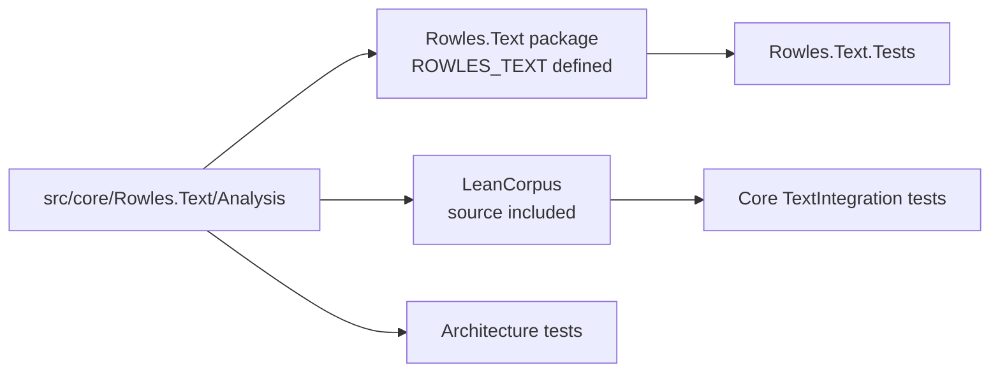

# Contributing to Rowles.Text

Rowles.Text owns LeanCorpus's canonical text-analysis implementation. Changes must work both as the standalone `Rowles.Text` package and when the same source is compiled directly into `LeanCorpus`.

## Make a first filter change

This flow applies equally to analysers, tokenisers and stemmers after substituting the matching area.

### 1. Find the implementation and tests

```text
Implementation
    src/core/Rowles.Text/Analysis/Filters/

Standalone correctness tests
    src/devops/Rowles.Text.Tests/Filters/

LeanCorpus integration tests
    src/devops/Rowles.LeanCorpus.Tests.Core/TextIntegration/
```

### 2. Run the focused standalone tests

```bash
./devops test -Suite text -Area Filters
```

Add the new test beside the component it protects:

```csharp
[Category(TestCategory.Unit)]
[Area(TestArea.Filters)]
public sealed class MyFilterTests
{
}
```

Use more than one `Area` only when the test genuinely protects more than one production contract.

### 3. Preserve the dual-build contract



The public namespaces deliberately remain:

```csharp
Rowles.LeanCorpus.Analysis
Rowles.LeanCorpus.Analysis.Analysers
Rowles.LeanCorpus.Analysis.Filters
Rowles.LeanCorpus.Analysis.Stemmers
Rowles.LeanCorpus.Analysis.Tokenisers
```

> [!IMPORTANT]
> Do not create a second Analysis implementation under `Rowles.LeanCorpus`, rename the public namespaces, or add a reference from `Rowles.Text` back to the search engine.

`ROWLES_TEXT` is for a genuine standalone implementation boundary, such as BCL file loading. It must not become a way to maintain two versions of ordinary analysis logic.

### 4. Check integration when behaviour crosses into indexing

Run LeanCorpus integration tests when the change affects analysed terms, offsets, positions or index-visible behaviour:

```bash
./devops test -Suite core -Area TextIntegration
```

### 5. Run affected selection

```bash
./devops test -Suite affected
```

The mapping in `scripts/devops/config/code-areas.psd1` normally selects both the standalone area and `core:TextIntegration`. Update that mapping if a new source location or analysis area is introduced.

## Add a component

| Component | Implementation | Standalone tests | Focused command |
| --- | --- | --- | --- |
| Analyser | `Analysis/Analysers/` | `Rowles.Text.Tests/Analysers/` | `-Area Analysers` |
| Tokeniser | `Analysis/Tokenisers/` | `Rowles.Text.Tests/Tokenisers/` | `-Area Tokenisers` |
| Filter | `Analysis/Filters/` | `Rowles.Text.Tests/Filters/` | `-Area Filters` |
| Stemmer | `Analysis/Stemmers/` | `Rowles.Text.Tests/Stemmers/` | `-Area Stemmers` |
| Language support | Keep coupled language code together | Matching language and component areas | Use every accurate area |

Lexicon and dictionary data belongs under `lexicons/` when it is a checked-in source or runtime asset. Record provenance, licence, generation and compatibility information in the [lexicons README](../../../lexicons/README.md).

## Choose the right test

| Behaviour | Test location |
| --- | --- |
| Token text, casing, stemming or Unicode rules | `Rowles.Text.Tests` |
| Offsets, position increments, position lengths or token graphs | `Rowles.Text.Tests` |
| Analysed text flowing through indexing and search | Core `TextIntegration` |
| Source inclusion, dependencies or conditional compilation | Architecture suite |
| A rule across generated inputs | A `Chaos` property test |
| A history of operations | A state-machine test |

Do not duplicate the complete standalone correctness suite in `TextIntegration`.

## Design checklist

### Stream before materialising

Prefer the existing streaming abstractions and span APIs. String, array or collection allocation is acceptable when it is deliberate and justified, not merely convenient.

### Treat Unicode as normal input

Include surrogate pairs, combining characters, Unicode categories, casing, punctuation, scripts without simple whitespace boundaries and malformed input where relevant. Avoid accidental culture-sensitive behaviour.

### Preserve token metadata

A filter that emits the expected words while corrupting positions or offsets is broken. Check:

- start and end offsets;
- position increments;
- position lengths;
- token graphs;
- payloads where used.

### Preserve Native AOT

Avoid reflection-based discovery, runtime code generation and new dynamic dependency assumptions.

## Use FsCheck when a property is clearer

Useful properties include:

```text
normalise(normalise(x)) == normalise(x)
offsets remain within the source text
arbitrary Unicode does not produce invalid positions
load(save(dictionary)) preserves its representation
```

Property tests normally use:

```csharp
[Category(TestCategory.Chaos)]
[Area(TestArea.Filters)]
[Technique(TestTechnique.PropertyBased)]
```

Keep generators bounded and retain explicit examples that communicate expected language behaviour.

## Measure hot-path changes

List current suites before choosing one:

```bash
./devops benchmark -List
```

Typical analysis smoke runs include:

```bash
./devops benchmark -Suite analysis-parity -Strat fast
./devops benchmark -Suite analysis-filters -Strat fast
```

A benchmark is required when making a performance claim, not for every correctness fix.

## Before submitting

- [ ] Standalone area tests pass.
- [ ] Core `TextIntegration` was run when index-visible behaviour changed.
- [ ] `./devops test -Suite affected` was run.
- [ ] Architecture tests were run for package or conditional-compilation changes.
- [ ] Both target frameworks were built when framework behaviour differs.
- [ ] Unicode and token metadata were considered.
- [ ] User-visible changes are documented and included in the changelog.
