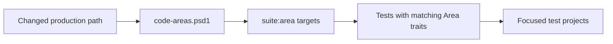

# Contributing to DevOps and tests

This guide is for adding tests, benchmarks and repository tooling. For everyday commands, start with the [DevOps README](README.md).

## Add a test

### 1. Find the production contract

Choose the area that owns the behaviour, such as `Search`, `Index`, `CodecKit`, `Store`, `Mapping` or `TextIntegration`.

### 2. Choose the test role

| Category | Use it when |
| --- | --- |
| `Unit` | A focused component contract has a direct expected result |
| `Integration` | Behaviour crosses meaningful production, file or process boundaries |
| `Chaos` | Generated data, corruption, hostile conditions or operation histories expose the risk |

Techniques such as property-based, state-machine and metamorphic testing describe how a test works. They do not require separate projects.

### 3. Put the test under the owning area

```text
src/devops/Rowles.LeanCorpus.Tests.Core/
    Search/
        Unit/
        Integration/
        Chaos/
```

Do not create a new test project merely because a test uses a different technique.

### 4. Add metadata

```csharp
[Category(TestCategory.Unit)]
[Area(TestArea.Search)]
public sealed class MyQueryTests
{
}
```

Use multiple areas only for a genuinely cross-cutting contract:

```csharp
[Category(TestCategory.Integration)]
[Area(TestArea.Index)]
[Area(TestArea.Store)]
public sealed class IndexPersistenceTests
{
}
```

### 5. Run the focused selection

```bash
./devops test -Suite core -Area Search -Category Unit
```

### 6. Connect new production paths

Affected testing follows this flow:



Update `scripts/devops/config/code-areas.psd1` when adding or moving a production area.

### 7. Run affected tests

```bash
./devops test -Suite affected
```

If the test accompanies a user-visible feature or fix, make sure the underlying change is represented in the current release changelog.

## Choose a useful oracle

| Technique | Useful oracle |
| --- | --- |
| Unit | Direct value, boundary or error assertion |
| Integration | Observable API, index or filesystem result |
| Property-based | Invariant, reference model or round trip |
| State machine | Model transition plus observable postcondition |
| Metamorphic | Defined relation between equivalent executions |
| Corruption | Explicit rejection or bounded fallback |
| Native AOT | Successful publish and execution |

Prefer stable logical IDs and stored fields over internal document IDs, segment names or incidental timing.

> [!WARNING]
> “Nothing threw” can be a robustness property, but it is rarely a complete correctness oracle.

## Add a property test

Use FsCheck when a rule matters across many inputs:

```text
decode(encode(x)) == x
normalise(normalise(x)) == normalise(x)
forceMerge(index(x)) preserves logical results
generated offsets remain inside the source text
```

Metadata normally includes:

```csharp
[Category(TestCategory.Chaos)]
[Area(TestArea.Index)]
[Technique(TestTechnique.PropertyBased)]
```

Keep generators bounded and meaningful. Retain explicit examples where they communicate the contract more clearly.

## Add a state machine

State machines are useful when failure depends on a history such as add, delete, commit, refresh, merge, reopen and rollback.

Place them under:

```text
<Area>/Chaos/StateMachine/
```

Each machine should have:

- a simple reference model;
- an isolated system-under-test harness;
- explicit operations and model transitions;
- postconditions over observable behaviour;
- readable operation descriptions for shrinking.

> [!IMPORTANT]
> Each machine owns its filesystem, writer and readers. Shared mutable fixtures make shrinking and reproduction unreliable.

## Add a metamorphic test

Use a metamorphic test when two executions should have a defined relationship:

```text
sequential indexing is set-equivalent to concurrent indexing
unmerged results exactly match force-merged results
serialise then deserialise preserves the observation
```

Place tests under `<Area>/Chaos/Metamorphic/` and use the shared relations in `Rowles.LeanCorpus.Tests.Shared/Metamorphic/` where appropriate.

Compare logical results, not incidental segment layout or timing.

## Add DevOps tooling

Choose the destination by responsibility:

| Change | Location |
| --- | --- |
| Top-level command orchestration | `scripts/devops/commands/` |
| Small reusable helper | `scripts/devops/common/` |
| Declarative suites, mappings or strategies | `scripts/devops/config/` |
| Larger reusable subsystem | `scripts/devops/support/` |

For a new top-level command:

1. Add an `Invoke-DevOps...` entry point under `commands/`.
2. Import it from `DevOps.psm1`.
3. Add it to the dispatcher.
4. Add concise top-level help and one useful example.
5. Put generic helpers and declarative data in their owning directories.
6. Exercise the command directly.
7. Run `./devops test -Suite affected`.
8. Update contributor documentation and the changelog when behaviour is visible.

Keep the root `devops` and `devops.ps1` wrappers small.

### Test execution infrastructure

All normal, affected, repeated, flaky and CI test commands use the shared
target pipeline. Add suite details such as the project, runner kind, supported
frameworks, coverage eligibility and diagnostic capabilities to
`scripts/devops/config/test-suites.psd1`; do not duplicate that information in
workflow YAML or another runner.

The pipeline resolves concrete targets, prepares each project or AOT publish
once, then starts a fresh process for every iteration. Artifact-producing runs
checkpoint `state.json` after each target under
`artifacts/test/runs/<run-id>/`. Missing or malformed MTP TRX data must remain
an incomplete result, never a pass. Keep report generation in the common
finalisation path so a failed target still leaves usable evidence.

Useful local checks include:

```bash
./devops test core --count 2 --filter 'FullyQualifiedName~Writer'
./devops test core --count 2 --fail-fast --filter 'FullyQualifiedName~Writer'
./devops test all --ci --framework net10.0
./devops diagnostics ps
```

Use `--diagnostics` for MTP diagnostic logs and the standalone
`devops diagnostics` commands for an explicitly selected process. Do not add
a full trace or memory dump to every repeated test iteration.

The manual GitHub Actions workflow **Test Stress & Diagnostics** is the shared
web entry point for repeated and platform-specific investigations. Keep it as
a thin argument builder over `./devops.ps1 test`; add suite resolution,
preparation or reporting behaviour to the DevOps pipeline and suite registry,
not to workflow YAML. Keep `count` and `CHAOS_ITERATIONS` independent when
documenting or reproducing a stress run.

## Add or change a benchmark

1. Select the suite and area that own the workload.
2. Keep corpus and setup equivalent to the comparison target.
3. Add a fast or dry route for smoke validation.
4. Record source commit, framework, strategy, host and corpus provenance.
5. Treat BenchmarkDotNet artefacts as evidence and generated pages as presentation.

List registered suites with:

```bash
./devops benchmark -List
```

## Validation by change

| Change | Validation |
| --- | --- |
| Normal test addition | Focused selection, then `-Suite affected` |
| Test infrastructure | Affected tests plus every directly impacted suite |
| Architecture boundary | `./devops test -Suite architecture` |
| AOT smoke path | `./devops aot` |
| Benchmark registration | `./devops benchmark -List` and a bounded smoke run |
| Coverage tooling | `./devops coverage -Clean` |
| Documentation tooling | `./devops docs build -SkipBenchmarks` |

> [!WARNING]
> Generated coverage, benchmark and DocFX output must not be hand-edited. Change the inputs or generator and regenerate it through `./devops`.

Repository guides copied into the site are mapped by `Copy-RepositoryDocumentation`. Add the canonical source and its site destination there, then update `docs/toc.yml`. Do not introduce a second metadata file when the repository README already contains the required catalogue or workflow.

## Before submitting

- [ ] The test or command has one clear owner.
- [ ] Metadata and affected mappings describe the real contract.
- [ ] The oracle is independent enough to catch the intended failure.
- [ ] Focused and affected validation were run.
- [ ] Platform, AOT and performance claims name their environment.
- [ ] Help, examples and contributor documentation match behaviour.
