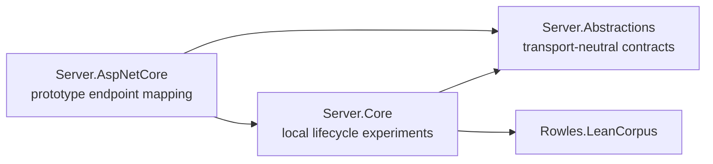

# LeanCorpus Server

LeanCorpus Server is a pre-alpha proof of concept exploring how LeanCorpus might be exposed through transport-neutral contracts and an ASP.NET Core host.

> [!CAUTION]
> The server cannot currently be run as a usable product or example. It is not ready for installation, deployment or integration. Its projects, APIs and persistence behaviour may change substantially.

## Current shape

| Project | Purpose |
| --- | --- |
| `Rowles.LeanCorpus.Server.Abstractions` | Early transport-neutral requests, responses and service contracts |
| `Rowles.LeanCorpus.Server.Core` | Local lifecycle and persistence experiments |
| `Rowles.LeanCorpus.Server.AspNetCore` | Prototype mapping of server contracts to HTTP endpoints |
| `Rowles.LeanCorpus.Server.Abstractions.Tests` | Selected contract and boundary checks |
| `Rowles.LeanCorpus.Server.Core.Tests` | Selected local-core behaviour checks |

The endpoint declarations under `Server.AspNetCore` are design experiments. Their presence does not mean the corresponding HTTP workflow is complete or supported.

## Status

The current work establishes possible project boundaries and validates early ideas. A runnable server, stable configuration, supported endpoint contract, packaging and production guidance will be documented only when those capabilities exist.
